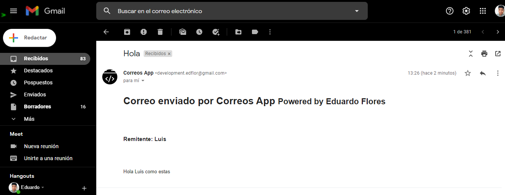

# Backend send mail app

## API send mail

Execute `npm install` restore node_modules

### End points

#### Send mail
`POST`
`https://mail-app-send.herokuapp.com/api/correos`

Body request: 
1. destinatario
2. nombre
3. asunto
4. msg

#### Get all
`GET`
`https://mail-app-send.herokuapp.com/api/correos`

#### Get for one
`GET`
`https://mail-app-send.herokuapp.com/api/correos/id-mail`

### Image
